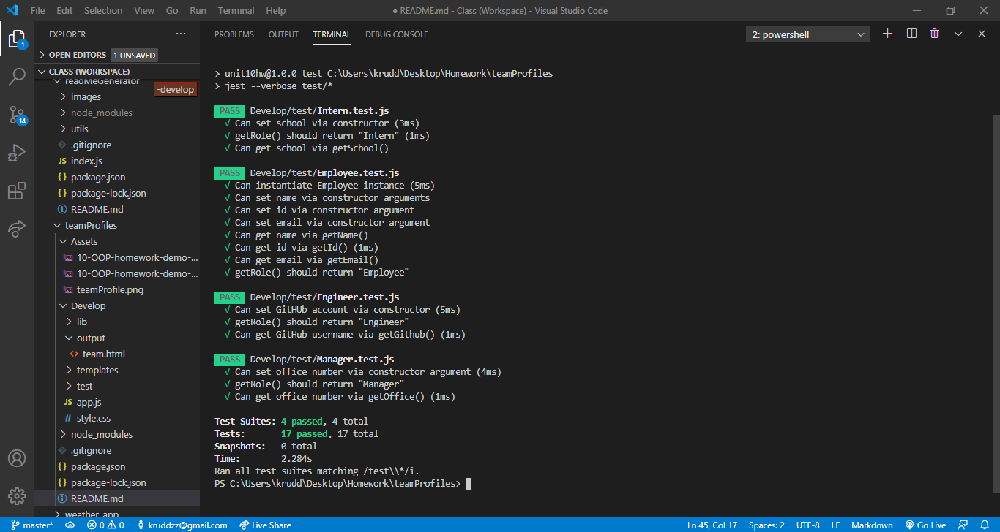
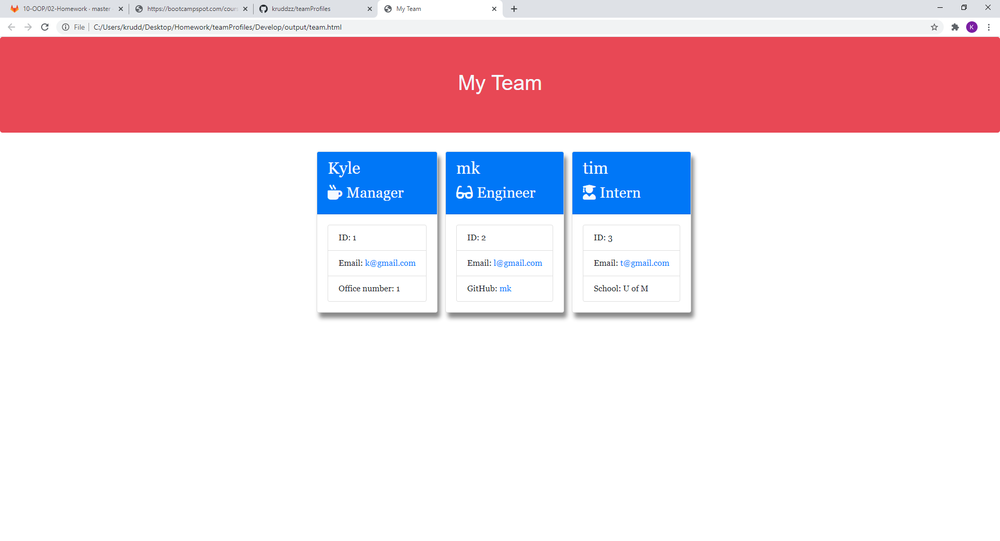
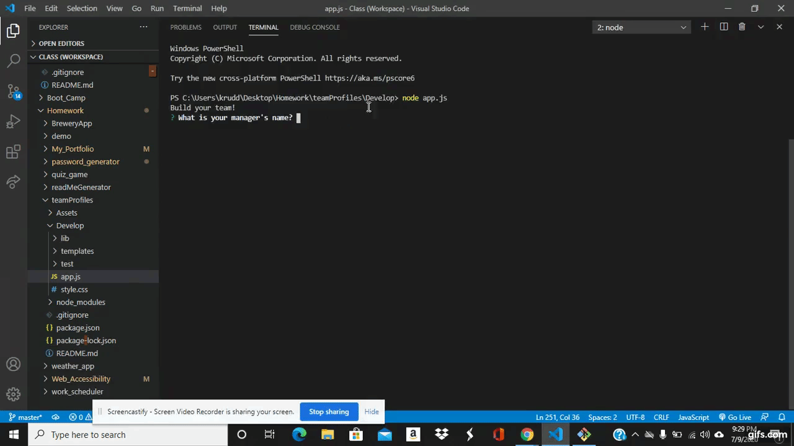

  

  # Project Title: A Team Profile Generator

  ## Project Description:
 
  Has a manager you want to be able to generate a webpage that displays basic team information. So that that you have quick access to names, emails, ids, and GitHub usernames.

  ## Table of Contents
  * [Installation](#installation)
  * [Usage](#usage)
  * [License](#license)
  * [Credits](#credits)
  * [Contributors](#contributors)
  * [Test](#test)
  * [Screenshot](#screenshot)
  * [Video](#video)
  * [Questions](#questions)
  * [Badges](#badges)
  
  ## Installation:
 
  You would need to clone or fork the repo. then you woud need to run npm i, npm i inquirer and npm i jest.

  ## Usage:
 
  After everything is installed. open up the teamProfile folder and open the develop folder in the terminal. then run app.js. Answer questions for manager. Then add has many engineers and interns has you would like. Then hit the no more employees option.Then in the outcome folder a team webpage will be generated.

  ## License:
  

  ## Credits:

  Kyle Rudderforth: https://github.com/kruddzz/teamProfiles
  
  ## Contributors:
  
  none

  ## Test:
   
  

  ## Screenshot:

  

  ## Video

  

  ## Questions:
  
  You can reach out to me useing other my email or github profile.
  
  Email: kruddzz@gmail.com
  
  Git Hub Profile: https://github.com/kruddzz

  ## Badges:
  
  

  
